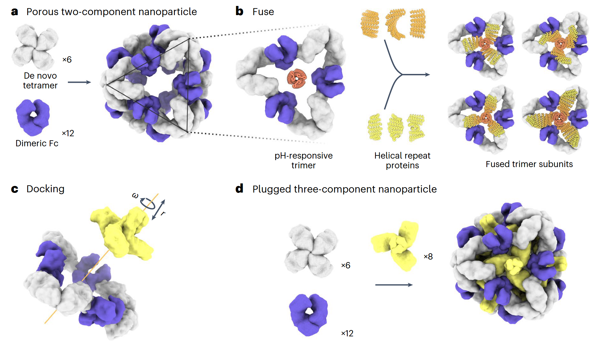

# Binder
## Targeted protein degradation

- The Challenge of Targeted Protein Degradation:

### 1.Designed endocytosis-inducing proteins degrade targets and amplify signals
:innocent: author:Buwei Huang, Mohamad Abedi
#### 1.1 Content
- diffenert stragies for designing binders to target the recepter which can be orthogonal to native ligand, induce conformation change and oligomerization.
#### 1.2 Design Strategies

#### 1.3 Method

- structure can be refined using FastRelsx and them using longxingcao'generate pipline.
- design two binder infusion using linker or rigid structure.

# Enzyme

# switch 

# nanoparticle
## PH-responsive
#### 1.Computational design of non-porous pH-responsive antibody nanoparticles

#### 1.1 Content
(1) Base on octahedral antibody nanoparticles and PH-dependent trimers previously reported,to extend the small PH-dependent trimers to fill the pore of the nanoparticles.

(2) Generat variants with either highly positively or highly negatively charged  interiors, and focused on changing interior surface residues of the trimeric plug.

(3) varying the number of histidine-containing hydrogen-bond networks and the hydrophobic packing with the trimer.the PH of plug disassembly counld be tuned over a remarkably wide range.
#### 1.2 Method
(1) WORMS helical fusion software to generate the fusion of trimer and helical repeat proteins.

(2) docking and trimming using PPXDock application, and evaluated using RPX score and NContact metrics.

(3) Rosetta Macromolecular Modeling suite to optimize the sequence residues contributing to either the fusion domains or interface between plug and nanoparticle.

